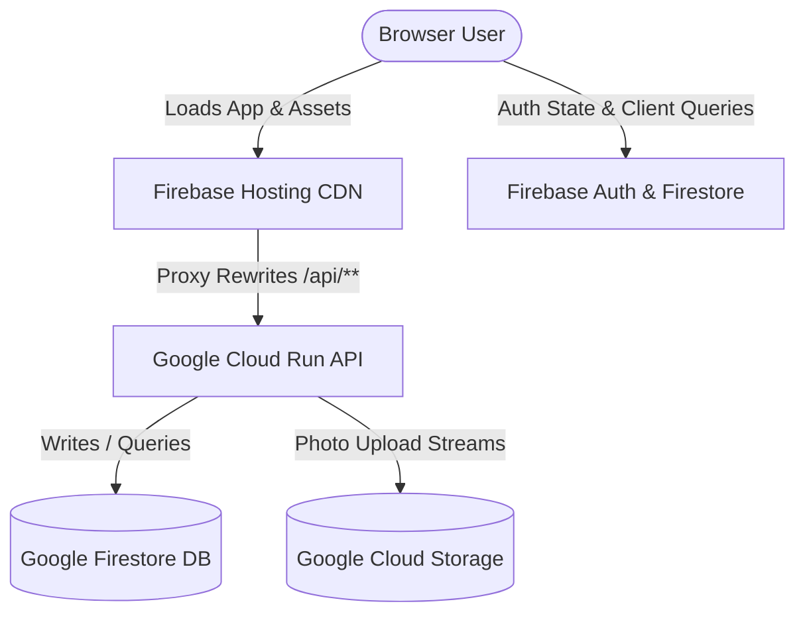

# Masti Mongsters Portal Architecture Documentation

This document describes the design, database schemas, and integration details of the Masti Mongsters React + Express + Firebase application.

---

## 🏗️ Overall Design
The portal is designed as a lightweight, scalable web application utilizing a hybrid serverless model:

### 1. Frontend (React Client)
* **Location**: `/client`
* **Technologies**: React 18, Vite, Tailwind CSS, Lucide icons.
* **Asset Loading**: High-speed global delivery through Firebase Hosting.
* **Authentication**: Firebase Client Auth SDK. Tracks authenticated session states and exposes conditional layouts (e.g. Admin publishing cards).

### 2. Backend API (Express Server)
* **Location**: `/server`
* **Technologies**: Express, Cors, Multer (Memory Storage), Firebase Admin SDK.
* **Deployment**: Hosted as a Docker container on Google Cloud Run.
* **CORS & Proxying**: Firebase Hosting uses a rewrite rule to forward all `/api/**` endpoints to the Cloud Run service. This bypasses CORS preflight overhead and provides single-origin security.

---

## 💾 Database Schemas (Firestore)
Firestore is utilized in Native mode. The backend uses the `firebase-admin` library (bypassing Client Security Rules) to query and write to the following collections:

### 1. `members`
* Renders the directory grid using `react-window` for virtualized/windowed scrolling.
* **Documents**: Keyed by unique ID strings (e.g., `"1"`).
* **Fields**:
  * `id` (Number): Unique ID (1 to 76+)
  * `name` (String): Full Name
  * `role` (String): `Active`, `Admin`, `VIP`, `Moderator`, `Legend`
  * `joined` (String): Join Date (e.g., `Oct 2012`)
  * `whatsapp` (String): Status value (`Active`, `Invited`)
  * `insta` (String): Instagram handle or link
  * `reason` (String): Biography/Joining note

### 2. `announcements`
* Displays community notices in chronological order.
* **Documents**: Auto-generated IDs.
* **Fields**:
  * `id` (Number): Order index
  * `title` (String): Announcement heading
  * `content` (String): Body description
  * `date` (String): Date string (`YYYY-MM-DD`)
  * `isPinned` (Boolean): If `true`, sorted to the top

### 3. `gallery`
* Serves the media wall.
* **Documents**: Auto-generated IDs.
* **Fields**:
  * `id` (Number): Order index
  * `title` (String): Highlight title
  * `tag` (String): Category (`Meetup`, `Screenshot`, `Admin`)
  * `date` (String): Month & Year (`Jun 2025`)
  * `imageUrl` (String): Public Google Cloud Storage URL of the photo

### 4. `requests`
* Stores onboarding requests submitted via the "Join Us" form.
* **Documents**: Keyed by sequential IDs.
* **Fields**:
  * `id` (Number): Auto-incremented ID
  * `name` (String): Full Name
  * `phone` (String): WhatsApp Number
  * `referer` (String): Who invited them
  * `reason` (String): Why they want to join
  * `handle` (String): Instagram handle
  * `date` (String): ISO Date string of submission

---

## 🖼️ Media Storage & Streaming Uploads
When users upload photos via the Gallery page:
1. The client sends a `multipart/form-data` payload containing the image file to `POST /api/gallery/upload`.
2. The Express server processes the file in-memory using `multer.memoryStorage()`.
3. The image buffer is streamed directly to the default Google Cloud Storage bucket (`jaisheelmastiproject.firebasestorage.app`) using the GCP storage write stream.
4. **Uniform Access Fallback**: If the bucket enforces Uniform Bucket-Level Access (blocking `blob.makePublic()`), the code falls back to generating a persistent token-based media URL (`https://firebasestorage.googleapis.com/v0/b/...`) which is saved in the Firestore `gallery` document.
